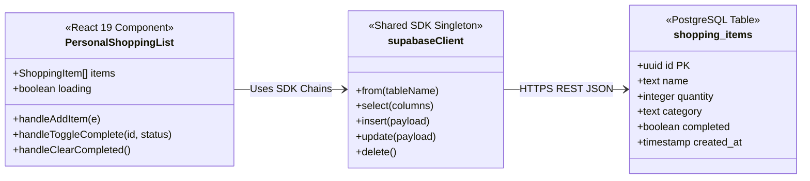

```mermaid
classDiagram
    direction LR
    class PersonalShoppingList {
        <<React 19 Component>>
        +ShoppingItem[] items
        +boolean loading
        +handleAddItem(e)
        +handleToggleComplete(id, status)
        +handleClearCompleted()
    }

    class supabaseClient {
        <<Shared SDK Singleton>>
        +from(tableName)
        +select(columns)
        +insert(payload)
        +update(payload)
        +delete()
    }

    class shopping_items {
        <<PostgreSQL Table>>
        +uuid id PK
        +text name
        +integer quantity
        +text category
        +boolean completed
        +timestamp created_at
    }

    PersonalShoppingList --> supabaseClient : Uses SDK Chains
    supabaseClient --> shopping_items : HTTPS REST JSON
```
