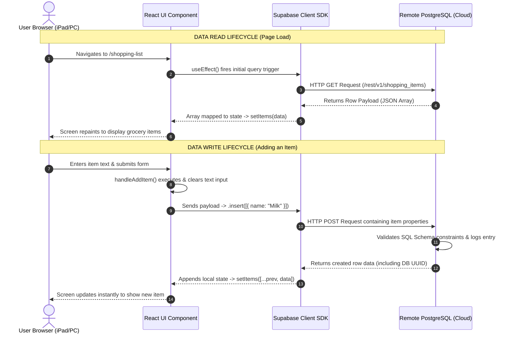

```mermaid
sequenceDiagram
    autonumber
    actor User as User Browser (iPad/PC)
    participant UI as React UI Component
    participant SDK as Supabase Client SDK
    participant DB as Remote PostgreSQL (Cloud)

    Note over User, DB: DATA READ LIFECYCLE (Page Load)
    User->>UI: Navigates to /shopping-list
    UI->>SDK: useEffect() fires initial query trigger
    SDK->>DB: HTTP GET Request (/rest/v1/shopping_items)
    DB-->>SDK: Returns Row Payload (JSON Array)
    SDK-->>UI: Array mapped to state -> setItems(data)
    UI-->>User: Screen repaints to display grocery items

    Note over User, DB: DATA WRITE LIFECYCLE (Adding an Item)
    User->>UI: Enters item text & submits form
    UI->>UI: handleAddItem() executes & clears text input
    UI->>SDK: Sends payload -> .insert([{ name: "Milk" }])
    SDK->>DB: HTTP POST Request containing item properties
    DB->>DB: Validates SQL Schema constraints & logs entry
    DB-->>SDK: Returns created row data (including DB UUID)
    SDK-->>UI: Appends local state -> setItems([...prev, data])
    UI-->>User: Screen updates instantly to show new item
```